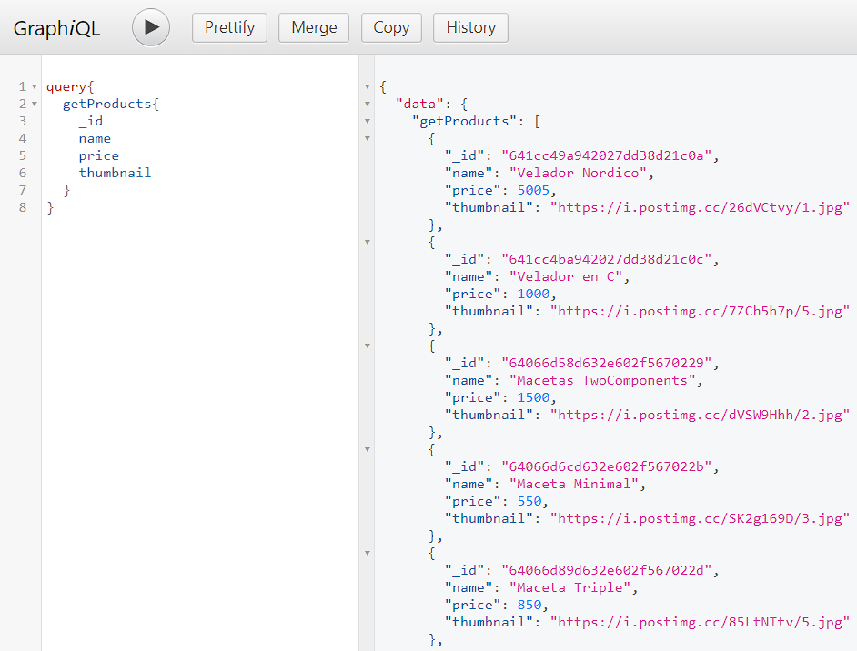
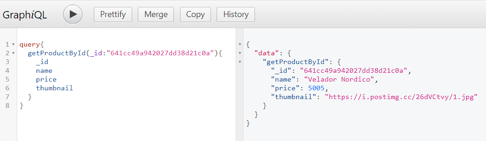
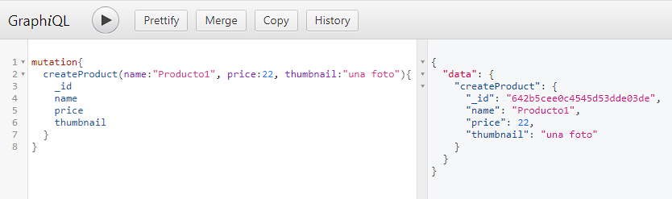
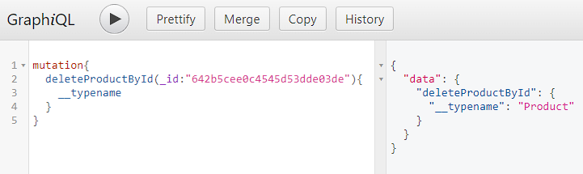

# Desafio 20 Curso Backend

## Reformar para usar GraphQL

## Comenzamos:

### Ejecutar el proyecto:

Para ejecutar el proyecto, el mismo puede descargarse como .zip o git clone.

[Clic aqui para descargar repo formato zip](https://github.com/matsanchez/desafio20-backend/archive/refs/heads/main.zip)

Copiar y pegar en la terminal :

```
git clone https://github.com/matsanchez/desafio20-backend.git
```

> Instalar las dependencias:

```
npm install
```

> Modos de ejecucion Local:
>
> > Usando process

```
node .\src\app.js port (numero) modo (cluster o fork)
"Ej: node .\src\app.js port 8020 modo fork"

node .\src\app.js (por defecto se conecta al puerto 8080 y modo fork)
```

> > Usando Nodemon

```
npm run dev (modo developer) Nodemon --- por defecto usa puerto: 8080
```

Crear el archivo .env con los datos correspondientes

```

# MONGODB ATLAS
MONGO_URI=

#NODEMAILER CONFIG
NODEMAILER_FROM=
NODEMAILER_PASS_APP=

#TWILIO CONFIG
TWILIO_ACCOUNT_SID=
TWILIO_AUTH_TOKEN=
TWILIO_PHONE_NUMBER=

#PERSISTENCE FACTORY
MOD_PERSISTENCE=
```

```
NOTA: FUERON MODIFICADAS ALGUNAS PARTES DE PRUEBA PARA EL DESAFIO DEL CURSO, SOLO SE USARON ALGUNOS METODOS CON GRAPHQL.

El mismo se puede ejecutar desde http://localhost:{puertoelegido}/graphql

Por defecto http://localhost:8080/graphql

- Se puede listar productos
- Buscar productos por id
- Crear Productos
- Eliminar productos por id
- Crear carrito de compras
- Buscar carrito por id.

```

Dejo algunas capturas de los ejemplos:






```
Autor: Matias Sanchez
```
